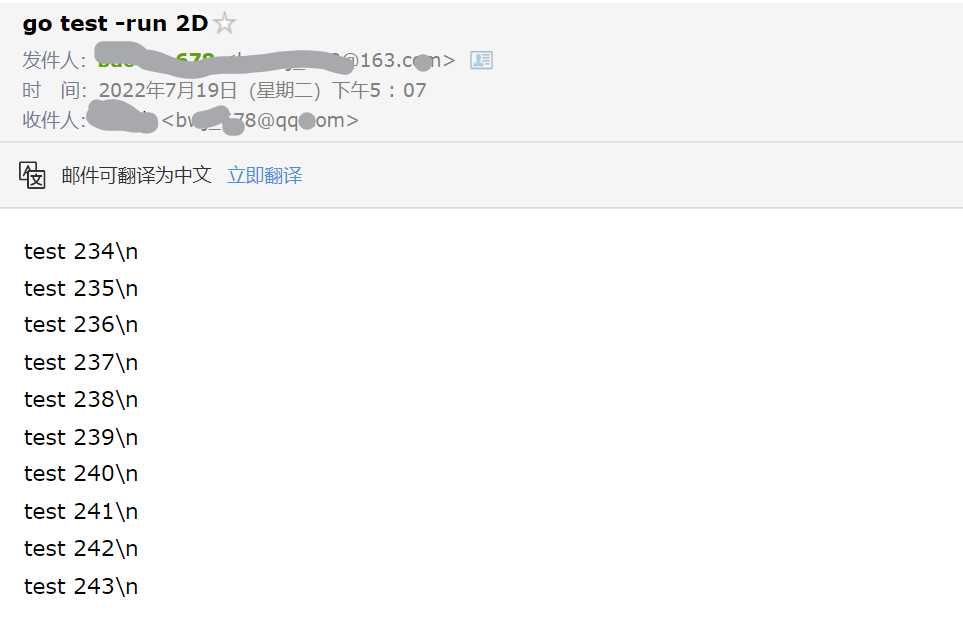

# Mail Informer

### 前言

最近在用服务器跑**MIT 6.824**的测试代码，由于不能时刻在电脑旁，所以想在服务器上**自动发邮件通知测试进度**。

## 1.Linux Mail配置

[Linux 使用命令发送邮件 | 菜鸟教程 (runoob.com)](https://www.runoob.com/w3cnote/centos-mail-command-sendmail.html)

### 1.安装mailx

~~~shell
yum install mailx -y
~~~

## 

### 2.配置`/etc/mail.rc`

添加下面配置内容：

~~~shell
set from=[邮箱地址]
set smtp=smtp.163.com
set smtp-auth-user=[邮箱用户]
set smtp-auth-password=[邮箱密码]
set smtp-auth=login
~~~

对于**163邮箱**，可以通过`设置->POP3/SMTP/IMAP->授权密码管理->新增授权密码`【注：网页登录的密码不可用】。

### 3.测试

运行下列命令，查看邮件是否发送成功。

~~~shell
echo 'hello world' | mail -s "test" bwj_678@qq.com
~~~

## 2.定时脚本

**执行的脚本**：在**$3**进程存在的情况下，发送最近的10个结果至指定邮箱。

~~~shell
#!/bin/bash

ps -ef | grep $3 | grep -v grep > /dev/null #查看执行的进程是否存在
if [ $? == 0 ];
then
	tail -n 10 $1 | mail -s "go test -run 2D" $2
fi
~~~

**设置定时任务**：七月的每个小时执行该脚本。

~~~shell
7 * * 7 * /root/MIT-6.824/src/raft/crontab.sh /root/MIT-6.824/src/raft/nohup.out bwj_678@qq.com 20728
~~~

### 3.测试

