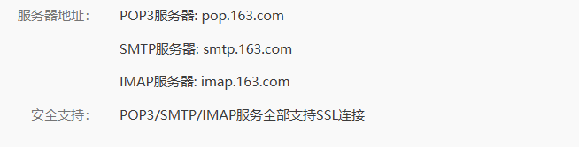
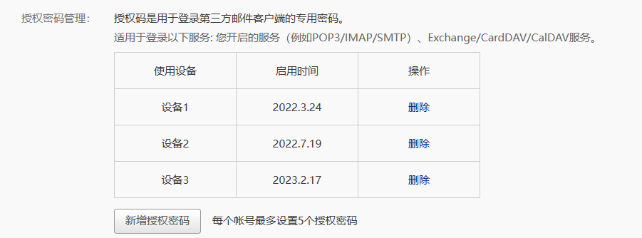
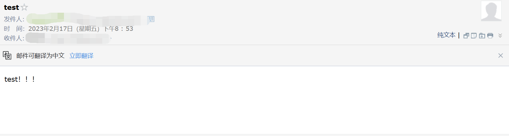

# 网页监听器
该脚本工具主要实现网页的监听，当网页出现监听的**字符串**或**正则表达式**匹配成功时，通过邮件发送通知。

## 1.使用
### 1.1.安装依赖
~~~ shell
pip install -r requirements.txt
~~~

### 1.2.编辑配置文件
编辑`config.yaml`内容以设置邮箱的信息。

~~~ yaml
mail_host: "smtp.163.com"
mail_user: "user@163.com"
mail_pass: "password"
mail_subject: "email-title"
mail_content: "email-content"
mail_receiver: "receiver@qq.com"
~~~

以`网易163邮箱`为例：

在`设置->POP3/SMTP/IMAP`我们可以查看`smtp`的服务器地址，并将其填至`config.yaml/mail_host`字段。

然后我们可以通过`设置->POP3/SMTP/IMAP->授权密码管理`新增密码，并将其填至`config.yaml/mail_pass`字段。

### 1.3.执行监听

我们可以通过执行下列命令执行监控：

~~~ shell
python main.py --url=<listening-url> --str=<listening-string-or-regex> --config=<config-path --time=<listening-gap-time>
~~~
其中
* `-u, --url`：设置监听的网易链接；
* `-s, --str`：设置监听的字段或者正则表达式；
* `-c, --config`：设置邮箱的配置文件位置，默认为当前目录下的**config.yaml**文件；
* `-t, --time`：设置每次爬取页面的间隔时间（单位：秒），默认为**60s**；

此外，我们也可以使用`nohup`将监听进程放到后台：

~~~ shell
nohup python main.py --url=<listening-url> --str=<listening-string-or-regex> --config=<config-path --time=<listening-gap-time> > nohup.log 2>&1 &
~~~

### 1.4.效果展示

